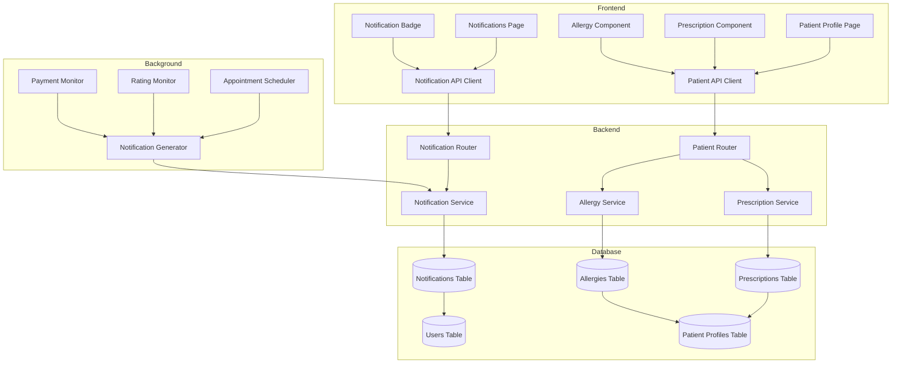

# Design Document: Notification System and Prescription/Allergy Management

## Overview

This design document outlines the implementation of two major features for the dental clinic management application:

1. **Active Notification System**: A real-time notification system that retrieves notifications from the database, supports multiple notification types, manages read/unread status, displays badge counts, and provides multilingual support.

2. **Prescription and Allergy Management**: A comprehensive system for doctors to add, edit, and delete patient prescriptions and allergies, with data displayed in the patient profile interface.

The system will be built using:
- **Backend**: Python FastAPI with SQLAlchemy ORM
- **Frontend**: React with TypeScript and TailwindCSS
- **Database**: SQLite (existing)

The design follows the existing architectural patterns in the codebase, including RESTful API design, role-based access control, and component-based UI structure.

## Architecture

### System Components



### Component Responsibilities

**Frontend Components:**
- **Notifications Page**: Displays list of notifications with read/unread status
- **Notification Badge**: Shows unread count in navigation/header
- **Patient Profile Page**: Displays patient data including prescriptions and allergies
- **Prescription Component**: UI for adding/editing/deleting prescriptions
- **Allergy Component**: UI for adding/editing/deleting allergies
- **API Clients**: Handle HTTP requests to backend endpoints

**Backend Components:**
- **Notification Router**: Handles notification-related API endpoints
- **Patient Router**: Extended to handle prescription and allergy endpoints
- **Notification Service**: Business logic for notification creation and management
- **Prescription Service**: Business logic for prescription CRUD operations
- **Allergy Service**: Business logic for allergy CRUD operations
- **Notification Generator**: Background service that creates notifications based on system events

**Database Tables:**
- **Notifications**: Stores notification records
- **Prescriptions**: Stores patient prescription records
- **Allergies**: Stores patient allergy records
- **Patient Profiles**: Extended to support relationships with prescriptions and allergies

### Data Flow

**Notification Flow:**
1. System event occurs (appointment scheduled, rating changed, etc.)
2. Notification Generator creates notification record in database
3. Frontend polls or receives notification via API
4. User views notification, marking it as read
5. Badge count updates in real-time

**Prescription/Allergy Flow:**
1. Doctor opens patient profile
2. Frontend fetches patient data including prescriptions and allergies
3. Doctor adds/edits/deletes prescription or allergy
4. Frontend sends request to backend API
5. Backend validates doctor permissions and updates database
6. Frontend refreshes patient data display

## Components and Interfaces

### Backend API Endpoints

#### Notification Endpoints

```python
# Get all notifications for current user
GET /api/notifications
Response: List[NotificationSchema]

# Get unread notification count
GET /api/notifications/unread-count
Response: {"count": int}

# Mark notification as read/unread
PATCH /api/notifications/{notification_id}/read
Request: {"is_read": bool}
Response: NotificationSchema

# Mark all notifications as read
POST /api/notifications/mark-all-read
Response: {"message": str, "updated_count": int}
```

#### Prescription Endpoints

```python
# Get all prescriptions for a patient
GET /api/patients/{patient_id}/prescriptions
Response: List[PrescriptionSchema]

# Add new prescription
POST /api/patients/{patient_id}/prescriptions
Request: PrescriptionCreate
Response: PrescriptionSchema

# Update prescription
PUT /api/prescriptions/{prescription_id}
Request: PrescriptionUpdate
Response: PrescriptionSchema

# Delete prescription
DELETE /api/prescriptions/{prescription_id}
Response: {"message": str}
```

#### Allergy Endpoints

```python
# Get all allergies for a patient
GET /api/patients/{patient_id}/allergies
Response: List[AllergySchema]

# Add new allergy
POST /api/patients/{patient_id}/allergies
Request: AllergyCreate
Response: AllergySchema

# Update allergy
PUT /api/allergies/{allergy_id}
Request: AllergyUpdate
Response: AllergySchema

# Delete allergy
DELETE /api/allergies/{allergy_id}
Response: {"message": str}
```

### Frontend API Client Functions

```typescript
// Notification API
export const notificationApi = {
  getNotifications: () => api.get<Notification[]>('/api/notifications'),
  getUnreadCount: () => api.get<{count: number}>('/api/notifications/unread-count'),
  markAsRead: (id: number, isRead: boolean) => 
    api.patch(`/api/notifications/${id}/read`, {is_read: isRead}),
  markAllAsRead: () => api.post('/api/notifications/mark-all-read')
};

// Prescription API
export const prescriptionApi = {
  getPrescriptions: (patientId: number) => 
    api.get<Prescription[]>(`/api/patients/${patientId}/prescriptions`),
  addPrescription: (patientId: number, data: PrescriptionCreate) => 
    api.post(`/api/patients/${patientId}/prescriptions`, data),
  updatePrescription: (id: number, data: PrescriptionUpdate) => 
    api.put(`/api/prescriptions/${id}`, data),
  deletePrescription: (id: number) => 
    api.delete(`/api/prescriptions/${id}`)
};

// Allergy API
export const allergyApi = {
  getAllergies: (patientId: number) => 
    api.get<Allergy[]>(`/api/patients/${patientId}/allergies`),
  addAllergy: (patientId: number, data: AllergyCreate) => 
    api.post(`/api/patients/${patientId}/allergies`, data),
  updateAllergy: (id: number, data: AllergyUpdate) => 
    api.put(`/api/allergies/${id}`, data),
  deleteAllergy: (id: number) => 
    api.delete(`/api/allergies/${id}`)
};
```

### React Component Structure

```typescript
// Notifications Page Component
interface NotificationsPageProps {}
interface NotificationItem {
  id: number;
  type: string;
  title: string;
  message: string;
  is_read: boolean;
  created_at: string;
  metadata?: Record<string, any>;
}

// Notification Badge Component
interface NotificationBadgeProps {
  count: number;
  onClick: () => void;
}

// Prescription Section Component
interface PrescriptionSectionProps {
  patientId: number;
  prescriptions: Prescription[];
  onAdd: (data: PrescriptionCreate) => void;
  onEdit: (id: number, data: PrescriptionUpdate) => void;
  onDelete: (id: number) => void;
}

// Allergy Section Component
interface AllergySectionProps {
  patientId: number;
  allergies: Allergy[];
  onAdd: (data: AllergyCreate) => void;
  onEdit: (id: number, data: AllergyUpdate) => void;
  onDelete: (id: number) => void;
}
```

## Data Models

### Database Models (SQLAlchemy)

#### Notification Model (Extended)

```python
from sqlalchemy import String, Integer, Boolean, DateTime, Text, ForeignKey
from sqlalchemy.orm import Mapped, mapped_column, relationship
from datetime import datetime
from .base import Base

class Notification(Base):
    __tablename__ = "notifications"

    id: Mapped[int] = mapped_column(primary_key=True)
    user_id: Mapped[int] = mapped_column(Integer, ForeignKey("users.id"), index=True)
    type: Mapped[str] = mapped_column(String(50))  # NotificationType enum value
    title: Mapped[str] = mapped_column(String(255))
    message: Mapped[str] = mapped_column(Text)
    is_read: Mapped[bool] = mapped_column(Boolean, default=False, index=True)
    created_at: Mapped[datetime] = mapped_column(DateTime, default=datetime.utcnow, index=True)
    
    # JSON metadata for additional notification-specific data
    # Stored as JSON string, parsed in application layer
    metadata: Mapped[str | None] = mapped_column(Text, nullable=True)
    
    # Relationship
    user = relationship("User", back_populates="notifications")
```

**Notification Types:**
- `appointment_reminder`: 30 minutes before appointment
- `appointment_rescheduled`: Patient rescheduled with new date
- `appointment_cancelled`: Patient cancelled with reason
- `analytics_check`: Reminder to check analytics
- `rating_decreased`: Rating decreased by 1+
- `rating_increased`: Rating increased by 1+
- `appointment_rated`: Patient rated appointment
- `review_left`: Patient left review
- `payment_reminder`: Payment due in 3 days

**Metadata Examples:**
```json
// appointment_reminder
{"appointment_id": 123, "time": "2024-01-15T14:30:00"}

// appointment_rescheduled
{"appointment_id": 123, "old_time": "2024-01-15T14:30:00", "new_time": "2024-01-16T10:00:00"}

// appointment_cancelled
{"appointment_id": 123, "reason": "Не могу прийти" | "причины нет"}

// appointment_rated
{"appointment_id": 123, "rating": 5}

// review_left
{"appointment_id": 123, "review_text": "Отличный врач!"}

// rating_decreased/increased
{"old_rating": 4.5, "new_rating": 4.0, "change": -0.5}

// payment_reminder
{"payment_id": 456, "amount": 500000, "due_date": "2024-01-18"}
```

#### Prescription Model (New)

```python
from sqlalchemy import String, Integer, DateTime, Text, ForeignKey
from sqlalchemy.orm import Mapped, mapped_column, relationship
from datetime import datetime
from .base import Base

class Prescription(Base):
    __tablename__ = "prescriptions"

    id: Mapped[int] = mapped_column(primary_key=True)
    patient_id: Mapped[int] = mapped_column(Integer, ForeignKey("patient_profiles.id"), index=True)
    medication_name: Mapped[str] = mapped_column(String(255))
    dosage: Mapped[str] = mapped_column(String(100))  # e.g., "500mg", "2 tablets"
    frequency: Mapped[str] = mapped_column(String(100))  # e.g., "twice daily", "every 8 hours"
    duration: Mapped[str] = mapped_column(String(100))  # e.g., "7 days", "2 weeks"
    notes: Mapped[str | None] = mapped_column(Text, nullable=True)
    prescribed_by: Mapped[int] = mapped_column(Integer, ForeignKey("users.id"))  # Doctor user_id
    prescribed_at: Mapped[datetime] = mapped_column(DateTime, default=datetime.utcnow, index=True)
    
    # Relationships
    patient = relationship("PatientProfile", back_populates="prescriptions")
    doctor = relationship("User", foreign_keys=[prescribed_by])
```

#### Allergy Model (New)

```python
from sqlalchemy import String, Integer, DateTime, Text, ForeignKey, Enum as SQLEnum
from sqlalchemy.orm import Mapped, mapped_column, relationship
from datetime import datetime
import enum
from .base import Base

class AllergySeverity(str, enum.Enum):
    MILD = "mild"
    MODERATE = "moderate"
    SEVERE = "severe"

class Allergy(Base):
    __tablename__ = "allergies"

    id: Mapped[int] = mapped_column(primary_key=True)
    patient_id: Mapped[int] = mapped_column(Integer, ForeignKey("patient_profiles.id"), index=True)
    allergen_name: Mapped[str] = mapped_column(String(255))  # e.g., "Penicillin", "Latex"
    reaction_type: Mapped[str] = mapped_column(String(255))  # e.g., "Rash", "Anaphylaxis"
    severity: Mapped[str] = mapped_column(String(20))  # AllergySeverity enum value
    notes: Mapped[str | None] = mapped_column(Text, nullable=True)
    documented_by: Mapped[int] = mapped_column(Integer, ForeignKey("users.id"))  # Doctor user_id
    documented_at: Mapped[datetime] = mapped_column(DateTime, default=datetime.utcnow, index=True)
    
    # Relationships
    patient = relationship("PatientProfile", back_populates="allergies")
    doctor = relationship("User", foreign_keys=[documented_by])
```

#### PatientProfile Model (Extended)

```python
# Add to existing PatientProfile model
class PatientProfile(Base):
    __tablename__ = "patient_profiles"
    
    # ... existing fields ...
    
    # New relationships
    prescriptions = relationship("Prescription", back_populates="patient", cascade="all, delete-orphan")
    allergies = relationship("Allergy", back_populates="patient", cascade="all, delete-orphan")
```

### Pydantic Schemas

#### Notification Schemas

```python
from pydantic import BaseModel
from datetime import datetime
from typing import Optional, Dict, Any

class NotificationBase(BaseModel):
    type: str
    title: str
    message: str

class NotificationCreate(NotificationBase):
    user_id: int
    metadata: Optional[Dict[str, Any]] = None

class NotificationSchema(NotificationBase):
    id: int
    user_id: int
    is_read: bool
    created_at: datetime
    metadata: Optional[Dict[str, Any]] = None
    
    class Config:
        from_attributes = True

class UnreadCountSchema(BaseModel):
    count: int
```

#### Prescription Schemas

```python
from pydantic import BaseModel
from datetime import datetime
from typing import Optional

class PrescriptionBase(BaseModel):
    medication_name: str
    dosage: str
    frequency: str
    duration: str
    notes: Optional[str] = None

class PrescriptionCreate(PrescriptionBase):
    pass

class PrescriptionUpdate(BaseModel):
    medication_name: Optional[str] = None
    dosage: Optional[str] = None
    frequency: Optional[str] = None
    duration: Optional[str] = None
    notes: Optional[str] = None

class PrescriptionSchema(PrescriptionBase):
    id: int
    patient_id: int
    prescribed_by: int
    prescribed_at: datetime
    
    class Config:
        from_attributes = True
```

#### Allergy Schemas

```python
from pydantic import BaseModel
from datetime import datetime
from typing import Optional

class AllergyBase(BaseModel):
    allergen_name: str
    reaction_type: str
    severity: str  # "mild", "moderate", "severe"
    notes: Optional[str] = None

class AllergyCreate(AllergyBase):
    pass

class AllergyUpdate(BaseModel):
    allergen_name: Optional[str] = None
    reaction_type: Optional[str] = None
    severity: Optional[str] = None
    notes: Optional[str] = None

class AllergySchema(AllergyBase):
    id: int
    patient_id: int
    documented_by: int
    documented_at: datetime
    
    class Config:
        from_attributes = True
```

### TypeScript Interfaces

```typescript
// Notification Types
export interface Notification {
  id: number;
  user_id: number;
  type: NotificationType;
  title: string;
  message: string;
  is_read: boolean;
  created_at: string;
  metadata?: Record<string, any>;
}

export type NotificationType =
  | 'appointment_reminder'
  | 'appointment_rescheduled'
  | 'appointment_cancelled'
  | 'analytics_check'
  | 'rating_decreased'
  | 'rating_increased'
  | 'appointment_rated'
  | 'review_left'
  | 'payment_reminder';

// Prescription Types
export interface Prescription {
  id: number;
  patient_id: number;
  medication_name: string;
  dosage: string;
  frequency: string;
  duration: string;
  notes?: string;
  prescribed_by: number;
  prescribed_at: string;
}

export interface PrescriptionCreate {
  medication_name: string;
  dosage: string;
  frequency: string;
  duration: string;
  notes?: string;
}

export interface PrescriptionUpdate {
  medication_name?: string;
  dosage?: string;
  frequency?: string;
  duration?: string;
  notes?: string;
}

// Allergy Types
export interface Allergy {
  id: number;
  patient_id: number;
  allergen_name: string;
  reaction_type: string;
  severity: 'mild' | 'moderate' | 'severe';
  notes?: string;
  documented_by: number;
  documented_at: string;
}

export interface AllergyCreate {
  allergen_name: string;
  reaction_type: string;
  severity: 'mild' | 'moderate' | 'severe';
  notes?: string;
}

export interface AllergyUpdate {
  allergen_name?: string;
  reaction_type?: string;
  severity?: 'mild' | 'moderate' | 'severe';
  notes?: string;
}
```


## Correctness Properties

*A property is a characteristic or behavior that should hold true across all valid executions of a system—essentially, a formal statement about what the system should do. Properties serve as the bridge between human-readable specifications and machine-verifiable correctness guarantees.*

### Property Reflection

After analyzing the acceptance criteria, I identified the following redundancies:
- Properties 6.2, 6.3, 6.4 (prescription CRUD with all fields) and 7.2, 7.3, 7.4 (allergy CRUD with all fields) can be combined into comprehensive CRUD properties
- Properties 4.2 and 4.3 (badge count changes) are related and can be combined into a single property about count accuracy
- Properties 6.6 and 7.6 (authorization checks) can be combined into a single authorization property
- Properties 3.2 and 3.3 (read/unread persistence) can be combined into a read status round-trip property

### Notification Properties

**Property 1: Notification ordering consistency**
*For any* list of notifications retrieved for a user, the notifications should be ordered by creation timestamp in descending order (newest first).
**Validates: Requirements 1.3**

**Property 2: Notification completeness**
*For any* notification retrieved from the system, it should include all required fields: type, title, message, read status, timestamp, and metadata.
**Validates: Requirements 1.4**

**Property 3: Cancellation reason default**
*For any* appointment cancellation notification, if no cancellation reason is provided, the notification metadata should contain "причины нет" as the reason.
**Validates: Requirements 2.3**

**Property 4: Rating notification metadata**
*For any* appointment rating notification, the notification metadata should contain the rating value provided by the patient.
**Validates: Requirements 2.7**

**Property 5: Review notification metadata**
*For any* review notification, the notification metadata should contain the complete review text provided by the patient.
**Validates: Requirements 2.8**

**Property 6: Read status persistence round-trip**
*For any* notification, marking it as read then querying the database should return is_read=true, and marking it as unread then querying should return is_read=false.
**Validates: Requirements 3.2, 3.3**

**Property 7: Unread count accuracy**
*For any* user, the unread notification count should equal the number of notifications where is_read=false, and this count should update correctly when notifications are marked as read or unread.
**Validates: Requirements 4.2, 4.3**

**Property 8: Notification language storage**
*For any* notification created for a user, the notification message should be stored in the user's current language preference.
**Validates: Requirements 5.2**

### Prescription Properties

**Property 9: Prescription CRUD completeness**
*For any* prescription created, it should be stored with all required fields (medication_name, dosage, frequency, duration, prescribed_at), and updates should persist correctly, and deletions should remove the prescription from the patient's record.
**Validates: Requirements 6.2, 6.3, 6.4**

**Property 10: Prescription ordering consistency**
*For any* list of prescriptions retrieved for a patient, the prescriptions should be ordered by prescribed_at timestamp in descending order (most recent first).
**Validates: Requirements 6.5**

### Allergy Properties

**Property 11: Allergy CRUD completeness**
*For any* allergy created, it should be stored with all required fields (allergen_name, reaction_type, severity, documented_at), and updates should persist correctly, and deletions should remove the allergy from the patient's record.
**Validates: Requirements 7.2, 7.3, 7.4**

### Authorization Properties

**Property 12: Doctor-only prescription and allergy operations**
*For any* prescription or allergy operation (create, update, delete), the system should reject the request if the authenticated user does not have doctor role permissions.
**Validates: Requirements 6.6, 7.6**

### Data Integrity Properties

**Property 13: Referential integrity on patient deletion**
*For any* patient, when the patient is deleted, all associated prescriptions and allergies should be automatically deleted (cascade delete).
**Validates: Requirements 9.5**

### API Properties

**Property 14: Authentication requirement**
*For any* API endpoint in the notification, prescription, or allergy systems, unauthenticated requests should be rejected with HTTP 401 status.
**Validates: Requirements 10.6**

**Property 15: Error response format**
*For any* invalid API request (malformed data, missing fields, invalid IDs), the system should return an appropriate HTTP status code (400, 404, 422) and a descriptive error message.
**Validates: Requirements 10.7**

## Error Handling

### Backend Error Handling

**Database Errors:**
- Connection failures: Return HTTP 503 with retry-after header
- Constraint violations: Return HTTP 409 with conflict details
- Not found errors: Return HTTP 404 with resource identifier

**Validation Errors:**
- Missing required fields: Return HTTP 422 with field-level error messages
- Invalid data types: Return HTTP 422 with type mismatch details
- Invalid enum values: Return HTTP 422 with allowed values list

**Authorization Errors:**
- Unauthenticated requests: Return HTTP 401 with authentication challenge
- Insufficient permissions: Return HTTP 403 with required role information
- Invalid tokens: Return HTTP 401 with token expiration details

**Business Logic Errors:**
- Duplicate prescriptions: Return HTTP 409 with existing prescription details
- Invalid patient ID: Return HTTP 404 with patient not found message
- Invalid notification type: Return HTTP 422 with supported types list

### Frontend Error Handling

**API Request Errors:**
- Network failures: Display toast notification with retry option
- 401 Unauthorized: Redirect to login page and clear stored tokens
- 403 Forbidden: Display permission denied message
- 404 Not Found: Display resource not found message
- 422 Validation Error: Display field-level validation messages
- 500 Server Error: Display generic error message with support contact

**User Input Validation:**
- Empty required fields: Display inline validation messages
- Invalid formats: Display format requirements
- Character limits: Display remaining character count

**State Management Errors:**
- Failed data fetch: Display error state with retry button
- Optimistic update failures: Rollback UI state and show error
- Stale data: Refresh data automatically or prompt user to refresh

### Notification Generation Error Handling

**Scheduler Errors:**
- Failed notification creation: Log error and retry with exponential backoff
- Missing appointment data: Log warning and skip notification
- Database write failures: Queue notification for retry

**Metadata Errors:**
- Missing metadata fields: Use default values and log warning
- Invalid JSON in metadata: Store as plain text and log error
- Oversized metadata: Truncate and log warning

## Testing Strategy

### Dual Testing Approach

This feature will use both unit tests and property-based tests to ensure comprehensive coverage:

**Unit Tests** will focus on:
- Specific examples of notification creation for each type
- API endpoint existence and basic functionality
- Edge cases like empty lists, missing data, and boundary conditions
- Integration between components (e.g., notification creation triggers)
- Error handling for specific scenarios

**Property-Based Tests** will focus on:
- Universal properties that hold for all inputs
- CRUD operations with randomly generated data
- Ordering and sorting consistency
- Authorization checks across all endpoints
- Data integrity and referential constraints

### Property-Based Testing Configuration

**Library Selection:**
- **Backend (Python)**: Use `hypothesis` library for property-based testing
- **Frontend (TypeScript)**: Use `fast-check` library for property-based testing

**Test Configuration:**
- Minimum 100 iterations per property test
- Each property test must reference its design document property
- Tag format: `# Feature: notification-prescription-management, Property {number}: {property_text}`

**Example Property Test Structure (Python):**
```python
from hypothesis import given, strategies as st
import pytest

@given(
    notifications=st.lists(
        st.builds(Notification, 
            created_at=st.datetimes(),
            # ... other fields
        ),
        min_size=1,
        max_size=50
    )
)
def test_notification_ordering_consistency(notifications):
    """
    Feature: notification-prescription-management
    Property 1: Notification ordering consistency
    """
    # Test that notifications are always returned in descending order
    result = get_notifications_for_user(user_id=1, notifications=notifications)
    timestamps = [n.created_at for n in result]
    assert timestamps == sorted(timestamps, reverse=True)
```

**Example Property Test Structure (TypeScript):**
```typescript
import fc from 'fast-check';

describe('Notification ordering consistency', () => {
  it('should always return notifications in descending order by timestamp', () => {
    // Feature: notification-prescription-management, Property 1
    fc.assert(
      fc.property(
        fc.array(notificationArbitrary, { minLength: 1, maxLength: 50 }),
        (notifications) => {
          const result = sortNotifications(notifications);
          const timestamps = result.map(n => new Date(n.created_at).getTime());
          const sortedTimestamps = [...timestamps].sort((a, b) => b - a);
          expect(timestamps).toEqual(sortedTimestamps);
        }
      ),
      { numRuns: 100 }
    );
  });
});
```

### Unit Test Coverage

**Backend Unit Tests:**
- Test each notification type creation with specific examples
- Test API endpoints return correct status codes
- Test authorization middleware blocks unauthorized requests
- Test database cascade deletes work correctly
- Test metadata JSON serialization/deserialization
- Test multilingual notification creation

**Frontend Unit Tests:**
- Test notification list rendering with mock data
- Test badge count display updates
- Test prescription/allergy form validation
- Test API client error handling
- Test component state management
- Test modal open/close behavior

### Integration Tests

**API Integration Tests:**
- Test complete notification flow: create → retrieve → mark read → verify count
- Test complete prescription flow: create → update → delete → verify removal
- Test complete allergy flow: create → update → delete → verify removal
- Test authentication flow with valid and invalid tokens
- Test multilingual notification retrieval

**Database Integration Tests:**
- Test foreign key constraints
- Test cascade deletes
- Test transaction rollbacks on errors
- Test concurrent access scenarios

### Test Data Generators

**Hypothesis Strategies (Python):**
```python
from hypothesis import strategies as st
from datetime import datetime, timedelta

# Notification generators
notification_types = st.sampled_from([
    'appointment_reminder', 'appointment_rescheduled', 
    'appointment_cancelled', 'analytics_check',
    'rating_decreased', 'rating_increased',
    'appointment_rated', 'review_left', 'payment_reminder'
])

notification_strategy = st.builds(
    Notification,
    type=notification_types,
    title=st.text(min_size=1, max_size=255),
    message=st.text(min_size=1, max_size=1000),
    is_read=st.booleans(),
    created_at=st.datetimes(
        min_value=datetime.now() - timedelta(days=365),
        max_value=datetime.now()
    )
)

# Prescription generators
prescription_strategy = st.builds(
    Prescription,
    medication_name=st.text(min_size=1, max_size=255),
    dosage=st.text(min_size=1, max_size=100),
    frequency=st.text(min_size=1, max_size=100),
    duration=st.text(min_size=1, max_size=100),
    notes=st.one_of(st.none(), st.text(max_size=500))
)

# Allergy generators
allergy_severity = st.sampled_from(['mild', 'moderate', 'severe'])

allergy_strategy = st.builds(
    Allergy,
    allergen_name=st.text(min_size=1, max_size=255),
    reaction_type=st.text(min_size=1, max_size=255),
    severity=allergy_severity,
    notes=st.one_of(st.none(), st.text(max_size=500))
)
```

**Fast-check Arbitraries (TypeScript):**
```typescript
import fc from 'fast-check';

// Notification generators
const notificationTypeArbitrary = fc.constantFrom(
  'appointment_reminder', 'appointment_rescheduled',
  'appointment_cancelled', 'analytics_check',
  'rating_decreased', 'rating_increased',
  'appointment_rated', 'review_left', 'payment_reminder'
);

const notificationArbitrary = fc.record({
  id: fc.integer({ min: 1 }),
  user_id: fc.integer({ min: 1 }),
  type: notificationTypeArbitrary,
  title: fc.string({ minLength: 1, maxLength: 255 }),
  message: fc.string({ minLength: 1, maxLength: 1000 }),
  is_read: fc.boolean(),
  created_at: fc.date().map(d => d.toISOString()),
  metadata: fc.option(fc.dictionary(fc.string(), fc.anything()), { nil: undefined })
});

// Prescription generators
const prescriptionArbitrary = fc.record({
  id: fc.integer({ min: 1 }),
  patient_id: fc.integer({ min: 1 }),
  medication_name: fc.string({ minLength: 1, maxLength: 255 }),
  dosage: fc.string({ minLength: 1, maxLength: 100 }),
  frequency: fc.string({ minLength: 1, maxLength: 100 }),
  duration: fc.string({ minLength: 1, maxLength: 100 }),
  notes: fc.option(fc.string({ maxLength: 500 }), { nil: undefined }),
  prescribed_by: fc.integer({ min: 1 }),
  prescribed_at: fc.date().map(d => d.toISOString())
});

// Allergy generators
const allergySeverityArbitrary = fc.constantFrom('mild', 'moderate', 'severe');

const allergyArbitrary = fc.record({
  id: fc.integer({ min: 1 }),
  patient_id: fc.integer({ min: 1 }),
  allergen_name: fc.string({ minLength: 1, maxLength: 255 }),
  reaction_type: fc.string({ minLength: 1, maxLength: 255 }),
  severity: allergySeverityArbitrary,
  notes: fc.option(fc.string({ maxLength: 500 }), { nil: undefined }),
  documented_by: fc.integer({ min: 1 }),
  documented_at: fc.date().map(d => d.toISOString())
});
```

### Test Organization

**Backend Test Structure:**
```
Backend/tests/
├── unit/
│   ├── test_notification_creation.py
│   ├── test_prescription_crud.py
│   ├── test_allergy_crud.py
│   └── test_authorization.py
├── property/
│   ├── test_notification_properties.py
│   ├── test_prescription_properties.py
│   ├── test_allergy_properties.py
│   └── test_api_properties.py
└── integration/
    ├── test_notification_flow.py
    ├── test_prescription_flow.py
    └── test_allergy_flow.py
```

**Frontend Test Structure:**
```
OdontoHub-1/src/tests/
├── unit/
│   ├── NotificationsPage.test.tsx
│   ├── PrescriptionSection.test.tsx
│   └── AllergySection.test.tsx
├── property/
│   ├── notificationProperties.test.ts
│   ├── prescriptionProperties.test.ts
│   └── allergyProperties.test.ts
└── integration/
    ├── notificationFlow.test.tsx
    └── patientDataFlow.test.tsx
```

### Continuous Testing

- Run unit tests on every commit
- Run property tests on pull requests
- Run integration tests before deployment
- Monitor test execution time and optimize slow tests
- Maintain minimum 80% code coverage for new code
